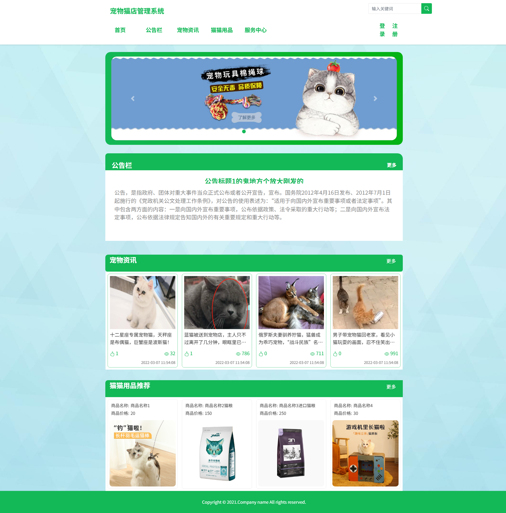
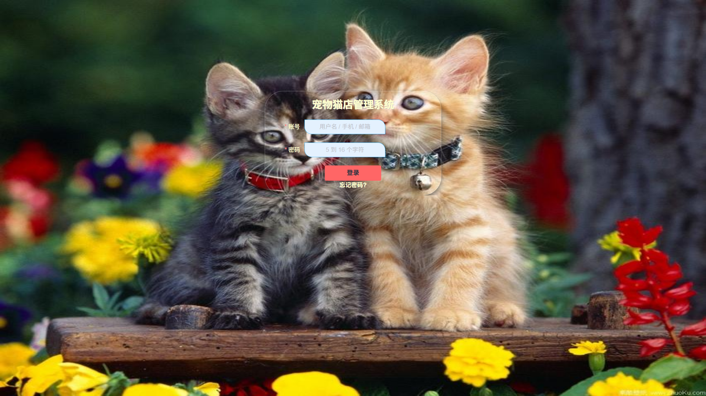

# 宠物猫店管理系统

> 🎓 **计算机毕业设计项目** | 本仓库为项目功能介绍与运行效果截图展示
>
> 🔥 **完整可运行源码 / 数据库脚本 / 论文等全套资料，请访问：[https://geekcode.top/project/springboot-myssql-宠物猫店管理系统/?utm_source=github](https://geekcode.top/project/springboot-myssql-宠物猫店管理系统/?utm_source=github)**
>
> 💬 微信：**ir9372**　|　🌐 更多项目：[极客代码 geekcode.top](https://geekcode.top/?utm_source=github)

---

## 项目概述

本项目为“宠物猫店管理系统”，旨在通过数字化手段优化宠物零售与服务的管理流程。系统采用前后端分离架构，核心功能涵盖商品管理、订单处理、会员服务、内容发布及用户互动等模块。前台面向消费者提供浏览商品、下单购买、查看公告及服务预约等功能；后台面向管理员提供全方位的数据维护与业务配置能力，包括轮播图、文章、评论、权限及各类业务实体的增删改查。适用人群主要为中小型宠物店经营者及其顾客。技术架构基于 Spring Boot 后端框架与 Vue 前端框架，结合 MySQL 数据库，实现了高效、稳定的业务逻辑处理与数据持久化存储，有效解决了传统手工记账效率低、信息不同步的问题。

## 技术架构

### 1. 总体架构
系统采用 B/S（Browser/Server）架构模式，遵循前后端分离的设计原则。
*   **前端层**：基于 Vue.js 框架构建单页面应用（SPA），负责用户界面渲染、交互逻辑处理及路由管理。通过 Axios 等 HTTP 客户端向后端发起异步请求。
*   **后端层**：基于 Spring Boot 框架搭建 RESTful API 服务。利用 `spring-boot-starter-web` 提供 Web 服务能力，通过 `spring-boot-starter-data-jpa` 实现对象关系映射（ORM），简化数据库操作。使用 Lombok 注解简化 Java Bean 代码编写，Fastjson 用于 JSON 数据序列化与反序列化。
*   **数据层**：使用 MySQL 作为关系型数据库，通过 `mysql-connector-java` 驱动连接。JPA 自动管理实体类与数据库表之间的映射关系，支持基本的 CRUD 操作及复杂查询。

### 2. 核心技术选型理由
*   **Spring Boot**: 具备“约定优于配置”的特性，快速构建独立运行的 Java 应用，内置 Tomcat 容器，简化部署流程。
*   **Vue.js**: 轻量级、响应式的前端框架，组件化开发模式有利于提高代码复用率和可维护性，适合构建动态交互丰富的管理系统界面。
*   **MySQL + JPA**: MySQL 成熟稳定，广泛适用于中小规模业务场景；JPA 提供了标准化的 ORM 接口，减少了 SQL 语句的手写工作量，提高了开发效率并降低了注入风险。
*   **POI (poi-ooxml)**: 引入 Apache POI 库，支持 Excel 文件的读取与写入，便于后台进行数据批量导入导出功能（虽具体功能未在截图详述，但依赖存在暗示此能力）。

## 功能模块

根据提供的路由配置与截图信息，系统功能划分为前台用户端与后台管理端两大部分。

### 1. 前台用户端
前台主要服务于普通访客及注册用户，侧重于信息展示与业务办理。

*   **账户与安全模块**
    *   **登录/注册**: 提供 `/account/login` 和 `/account/register` 入口，支持新用户注册及老用户身份验证。
    *   **密码找回**: 通过 `/account/forgot` 提供忘记密码后的重置流程。
    *   **个人中心**: 包含 `/user/index`（个人主页）、`/user/info`（个人信息修改）、`/user/password`（修改密码）及 `/user/collect`（收藏管理）。
*   **内容资讯模块**
    *   **文章中心**: 通过 `/article/list` 浏览文章列表，`/article/details` 查看文章详情。
    *   **公告通知**: 通过 `/notice/list` 查看店铺公告，`/notice/details` 查看公告具体内容。
    *   **多媒体资源**: 支持图片 (`/media/image`)、音乐 (`/media/music`) 和视频 (`/media/video`) 的在线浏览或播放。
*   **商品与服务模块**
    *   **商品展示**: 通过 `/cat_products/list` 浏览宠物猫相关商品列表，`/cat_products/details` 查看特定商品的详细信息。
    *   **服务中心**: 提供 `/service_centre/list` 和 `/service_centre/details`，展示如洗澡、美容等服务项目。
    *   **搜索功能**: 通过 `/search` 和 `/search/details` 实现对全站内容的关键词检索。
*   **交易与预约模块**
    *   **订单管理**: 通过 `/order_center/edit` 进行订单信息的编辑或确认操作。
    *   **会员管理**: 通过 `/membership_center/edit` 维护会员相关信息。
    *   **预约管理**: 通过 `/booking_management/edit` 进行服务或商品的预约登记。

### 2. 后台管理端
后台主要服务于管理员，侧重于数据维护、配置管理及权限控制。

*   **基础信息管理**
    *   **轮播图管理**: 对应 `/slides/table` 和 `/slides/view`，用于首页广告位的图片上传、排序及启用状态管理。
    *   **公告管理**: 对应 `/notice/table` 和 `/notice/view`，发布和维护店铺通知信息。
    *   **文章管理**: 对应 `/article/table` 和 `/article/view`，以及 `/article_type/table` 和 `/article_type/view`，实现文章内容及分类标签的全生命周期管理。
    *   **媒体资源管理**: 对应 `/media/video` 和 `/media/audio`，集中管理视频和音频素材。
*   **业务数据管理**
    *   **商品管理**: 对应 `/cat_products/table` 和 `/cat_products/view`，维护宠物猫商品的库存、价格及描述信息。
    *   **订单中心**: 对应 `/order_center/table` 和 `/order_center/view`，查看所有用户提交的订单状态并进行处理。
    *   **会员中心**: 对应 `/membership_center/table` 和 `/membership_center/view`，管理会员等级、积分及权益信息。
    *   **服务中心**: 对应 `/service_centre/table` 和 `/service_centre/view`，定义和管理可预约的服务项目。
    *   **用户注册审核**: 对应 `/user_registration/table` 和 `/user_registration/view`，查看新用户的注册申请信息。
*   **系统与权限管理**
    *   **权限管理**: 对应 `/auth/table` 和 `/auth/view`，配置系统角色及访问控制策略。
    *   **链接管理**: 对应 `/link/table` 和 `/link/view`，维护站内或外部跳转链接。
    *   **评论管理**: 对应 `/comment/table` 和 `/comment/view`，审核用户发表的商品或服务评价。
    *   **广告位管理**: 对应 `/ad/table` 和 `/ad/view`，配置其他类型的广告投放位。
    *   **安全设置**: 提供 `/forgot` 和 `/user/password` 路由供管理员自身账号的安全维护。

## 用户角色与权限

根据系统路由结构及后台功能划分，主要涉及以下两类角色：

### 1. 普通用户（前台使用者）
*   **游客**: 可以浏览前台公开信息，包括首页轮播图、公告列表、文章列表、商品列表、服务列表及媒体资源。可以进行全局搜索。
*   **注册用户**: 在游客权限基础上，拥有以下专属权限：
    *   **账户管理**: 修改个人资料、更改密码、找回密码。
    *   **互动与收藏**: 对商品或文章进行收藏，发表评论。
    *   **业务办理**: 创建和编辑订单，管理会员信息，提交服务或商品预约申请。

### 2. 管理员（后台使用者）
*   **超级管理员/运营人员**: 拥有后台所有模块的最高权限，能够执行以下操作：
    *   **内容运维**: 增删改查轮播图、公告、文章、文章分类、媒体文件（视频/音频）。
    *   **业务管控**: 管理商品数据、查看和处理所有订单、维护会员档案、配置服务项目、审核用户注册信息。
    *   **社区治理**: 查看和删除违规评论。
    *   **系统配置**: 管理权限组（Auth）、配置广告位（Ad）、维护友情链接（Link）。
    *   **自身安全**: 修改管理员登录密码。

*注：现有信息未明确区分不同级别的管理员角色（如只读管理员、财务管理员等），仅体现了统一的管理员视图权限范围。*

## 项目特色与创新点

1.  **一体化业务闭环设计**：
    系统不仅涵盖了传统的电商商品销售（`cat_products`, `order_center`），还深度整合了线下服务预约（`service_centre`, `booking_management`）和内容营销（`article`, `notice`）。这种“商品+服务+内容”三位一体的模式，符合现代宠物店线上线下融合（O2O）的经营趋势，能够有效提升用户粘性和转化率。

2.  **丰富的多媒体内容支撑**：
    专门设计了 `/media/video`、`/media/audio` 和 `/media/image` 的管理与展示模块。这使得宠物店可以通过视频展示猫咪的生活状态、音频介绍护理知识、图片呈现商品细节，相比纯文字图文更具感染力和真实感，有助于建立品牌信任度。

3.  **灵活的权限与配置体系**：
    后台引入了独立的 `/auth`（权限）和 `/link`（链接）管理模块，表明系统在扩展性上做了考量。管理员可以根据业务发展灵活调整菜单可见性或外部合作链接，无需频繁修改代码即可适应运营需求的变化。

4.  **标准化的数据交互体验**：
    前端采用统一的 Table/View 双路由模式（如 `/xxx/table` 用于列表页，`/xxx/view` 用于详情页），保证了后台操作界面的高度一致性，降低了管理员的学习成本，提升了数据录入与查询的效率。

## 部署环境

为确保系统正常运行，需准备以下软硬件环境：

### 1. 硬件要求
*   **CPU**: 建议 2 核及以上处理器。
*   **内存**: 建议 4GB 及以上 RAM（开发阶段建议 8GB 以流畅运行 IDE 和浏览器）。
*   **硬盘**: 至少预留 10GB 可用空间用于安装软件、数据库及存储上传的多媒体文件。

### 2. 软件环境
*   **操作系统**: Windows 10/11, macOS, 或 Linux (CentOS/Ubuntu)。
*   **Java 开发工具包 (JDK)**: JDK 1.8 或更高版本（推荐 JDK 1.8 LTS，兼容性好）。
*   **数据库**: MySQL 5.7 或 MySQL 8.0。需安装相应的 JDBC 驱动。
*   **Node.js**: 用于前端 Vue 项目的依赖安装与打包编译。建议版本 v14.x 或 v16.x。
*   **Web 服务器**: 
    *   开发阶段：Spring Boot 内置 Tomcat。
    *   生产阶段：Nginx（用于反向代理静态资源及转发 API 请求）或独立 Tomcat/Jetty。
*   **IDE (集成开发环境)**: IntelliJ IDEA 或 Eclipse（用于后端开发），VS Code 或 WebStorm（用于前端开发）。

### 3. 依赖组件
*   **Maven**: 用于管理后端 Java 项目的依赖库（Spring Boot, MySQL Connector, Lombok, Fastjson, POI 等）。
*   **npm/yarn**: 用于管理前端 JavaScript 包的依赖。

## 五、技术特性

- 前后端集成部署，前端资源打包至后端 static 目录

## 六、功能模块截图

### 前台用户端

#### 前台首页框架

### 后台管理端

#### 后台-登录

## 项目功能截图

### 后台管理端

### 前台用户端

